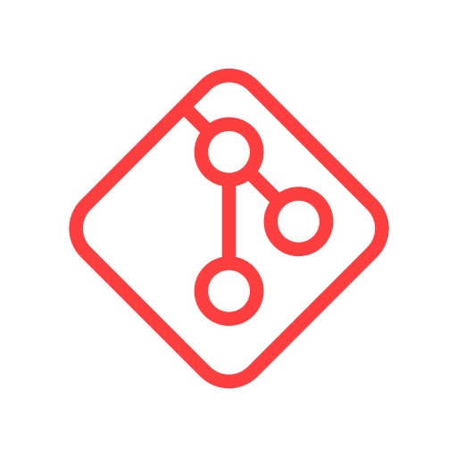

## Hey You! 👋 
## Thanks for checking out my profile.

## I am <A href="https://kratinjay.github.io/">Kratinjay Gupta</A>
- 🔭 I’m currently learning WordPress Plugin and Themes Development.
- 🌱 I’m also learning Full-Stack Development.
- 🙋🏻‍♂️ I’m looking to collaborate in Open Source Projects.

<h3><b>Small Intro:</b></h3>
I am Computer Science Graduate, in Bachelors of Computer Application(BCA). I am a life-time learner with a keen interest in Web Development. I love collaborating in Open Source.

<h3><b>Skills:</b></h3>
<h4><b>Front-End</b></h4>
<ul>
<li></img></li>
<li></img></li>
<li></img></li>
<li></img></li>
</ul>
<h4><b>Back-End</b></h4>
<ul>
<li></img></li>
<li></img></li>
<li></img></li>
</ul>
<h3><b> Miscelleneous SKills:</b></h3>
<h4><b>Tools and Softwares</b></h4>
<ul>
<li></img></li>
<li></img></li>
<li></img></li>
<li></img></li>
</ul>
<h4><b>Operating Systems</b></h4>
<ul>
<li></img></li>
<li></img></li>
</ul>
<!--<h4>Chat with Me one to one here:-</h4>-->
